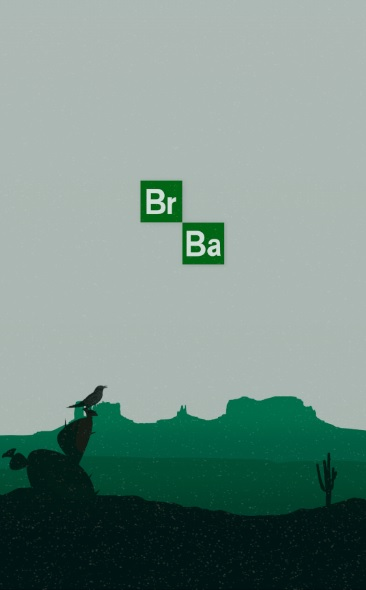
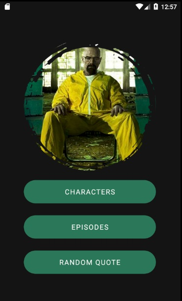
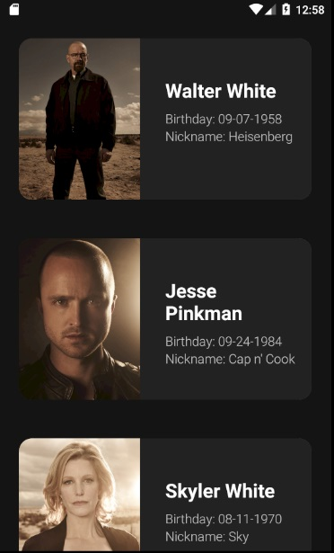
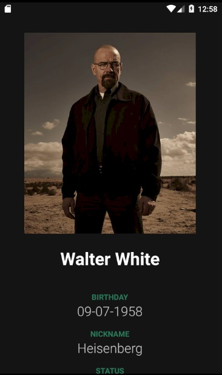
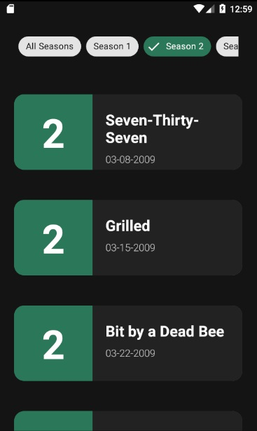
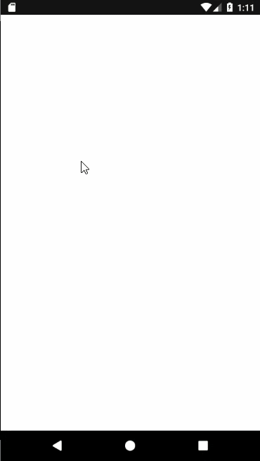

# Breaking Bad Excercise

An android application created with the aim of practicing the use of APIs, for this I used the [Breaking Bad API](https://breakingbadapi.com/), which shows a list of the
characters, episodes and popular quotes of this series.

API used: https://breakingbadapi.com/

## Activities Screenshots
Splash | Main | Characters
------ | ----- | ------
 |  | 

Character Detail | Episodes | Quotes
------           | -----    | ------
 |  | 

Preview |
------- |

